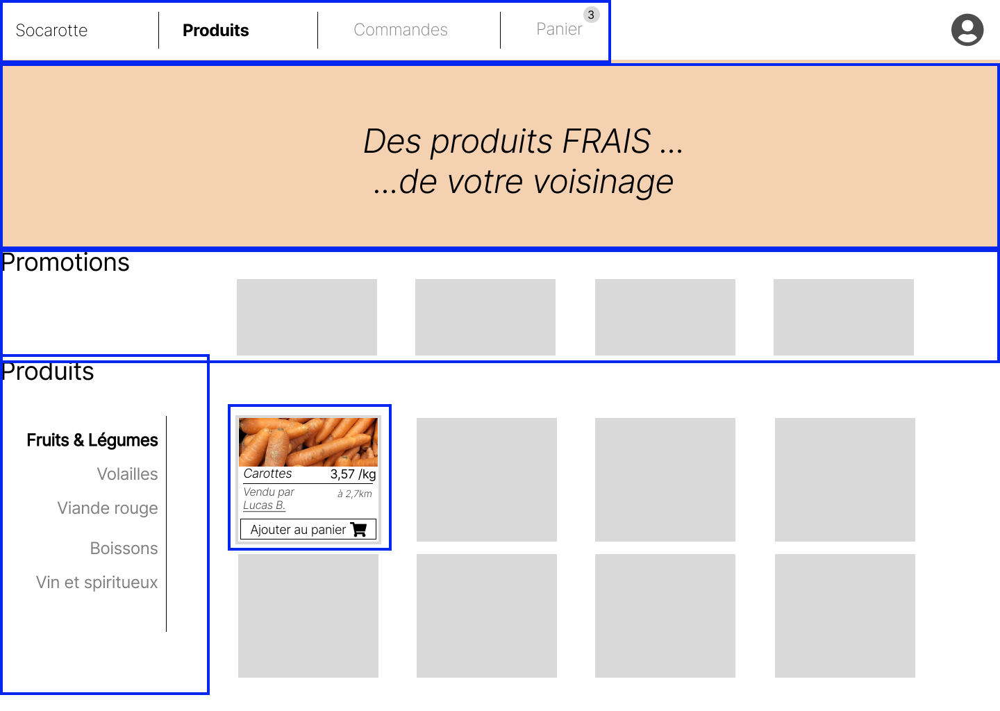
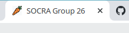

# Reactive Frontend Workshop

This workshop is made for students of EPITA - SIGL 2024.

The aim of the workshop is to implement a reactive user interface (UI) for Socarotte. 
To implement it, we will use:
- [NodeJS](https://nodejs.org/en/about/): to be able to use dependencies (other developper's code)
- [ReactJS](https://fr.reactjs.org/): to manage DOM elements rendering and local component state
- [ViteJS](https://vitejs.dev/): to bundle all our source files into a single `JavaScript` file (that will be our production artifact).

> Note: We are doing only the user interface without any data persistency...for now!

## Step 0: Tools

### IDE

We strongly encourage you to use [Visual Studio Code](https://code.visualstudio.com) for your frontend project.
It's totally free and open source.

You don't have to install any extra plugins for this workshop.

### Install NodeJS

You need to install NodeJS (a.k.a `node`) on your local machine.

Because NodeJS is a tool that evolves fast and has multiple versions, we will use a versionning tool to help us using multiple versions, depending on the project we're working on: [NVM](https://github.com/nvm-sh/nvm) (Node Version Manager)

To install `nvm`, follow instructions in the README of the project: https://github.com/nvm-sh/nvm#installing-and-updating

Once `nvm` is install:

- Create a file `.nvmrc` with `v19` inside
- Install node v19 using `nvm`: `nvm install v19`

Then, everytime you work on your project, you can type `nvm use` command, and it will switch you to the version inside the `.nvmrc` file.

You can verify if everything is fine by checking node version: `node -v`
and it should output version 19.

## Step 1: Create **YOUR** Socarotte

For this Step, you can refer to the frontend-template we've created:
[SOCRA-EPITA-SIGL-2024/frontend-template (main)](https://github.com/SOCRA-EPITA-SIGL-2024/frontend-template)

### Create your HTML view

Create only with HTML 5 and CSS 3 **your** "Produits" view of Socarotte.

You **do not** have to respect the same layout as our model nor the following screenshot, but we insist on having the following elements (again you can put them wherever you feel like on the page):

- Keep your html `<title>` to `Socra Group XX` (replacing XX by your group number)
- Main navigation bar with "Produits", "Commandes" and "Panier"
- A banner with whatever images / text you feel like putting
- A "Promotion" lane where you could see some products on discount. A discount has:
  - a name
  - a price
  - an amount of the discount
  - the price discounted
- A product navigation with "Fruit & Légume", "Volaille", "Viande Rouge", "Boissons", "Vin et spiritueux"
- A product card with:
  - an image of the product
  - a product name
  - a price per kg
  - a description of who is selling and how far from our current location
  - a button to add the product to basket



Make it yours!

> Important: it is **only static**. You only create a view where navigation is not active. You only create the view for "Produits"

### Make me responsive

Make your version of Socarotte responsive by adding `@media` queries for the following sizes:

- `@media (max-width: 460px) { ... }`: except menus, all elements are displayed in one column ("Promotion"'s items and "Product)
- `@media (max-width: 768px) { ... }`: the banner is no longer displayed
- `@media (min-width: 1200px) { ... }`: increase the font-size (you will decide the best ratio)

> Important: do **NOT** forget to add the following metadata in the head of your HTML document:

```xml
<meta name="viewport" content="width=device-width, initial-scale=1.0">
```

### Add favicon

In order to have a nice logo on your browser tab when running Socarotte, feel free to download this [nice carrot icon](https://raw.githubusercontent.com/SOCRA-EPITA-SIGL-2024/frontend-template/main/public/favicon.ico).



You can of course build your own.

Once downloaded or created, simply add it to under `public/favicon.ico` in your repository. `http-server` will serve it and your browser should render it.

## Step 2: Add `React` and `Vite`

Sofar, we have a responsive application, but we don't handle any user interactions (menu selection or button clicks).

[ReactJS](https://fr.reactjs.org/) is a JavaScript framework from Facebook.
We chose this since it seems to be the most notorious one, when checking [NodeJS framework trends](https://www.npmtrends.com/@angular/core-vs-angular-vs-react-vs-vue-vs-svelte) with its competitors.

Like the previous step, you can see how we did the step 2 in the [freontn]

### Install dependencies

- From you project repository, create a new folder `frontend`.
- Move or create a new `frontend/.nvmrc` file with:

    ```plain
    v19
    ```

- Move and rename your `styles.css` file to `frontend/src/App.css`
- Move your `public/favicon.ico` file to `frontend/public/favicon.ico`
- Move your `Dockerfile` file to `frontend/Dockerfile`
- Create a new `frontend/index.html` with (replacing `XX` by your group number):

    ```html
    <!DOCTYPE html>
    <html lang="fr">
    <head>
        <meta charset="UTF-8" />
        <meta name="viewport" content="width=device-width, initial-scale=1.0" />
        <title>SOCRA Group XX</title>
    </head>
    <body>
        <div id="root"></div>
        <script type="module" src="/src/main.jsx"></script>
    </body>
    </html>
    ```

- Add a new `frontend/.gitignore` file with

    ```plain
    # Logs
    logs
    *.log
    npm-debug.log*
    yarn-debug.log*
    yarn-error.log*
    pnpm-debug.log*
    lerna-debug.log*

    node_modules
    dist
    dist-ssr
    *.local

    # Editor directories and files
    .vscode/*
    !.vscode/extensions.json
    .idea
    .DS_Store
    *.suo
    *.ntvs*
    *.njsproj
    *.sln
    *.sw?
    ```

- Add a new `frontend/package.json` file with:

    ```json
    {
        "name": "socarotte",
        "private": true,
        "type": "module",
        "scripts": {
            "dev": "vite",
            "build": "vite build",
            "preview": "vite preview"
        },
        "dependencies": {
            "@fortawesome/fontawesome-free": "^6.4.0",
            "react": "^18.2.0",
            "react-dom": "^18.2.0"
        },
        "devDependencies": {
            "@vitejs/plugin-react": "^3.1.0",
            "vite": "^4.2.1"
        }
    }
    ```

- Add a new `frontend/vite.config.js` file with:

    ```js
    import { defineConfig } from "vite";
    import react from "@vitejs/plugin-react";

    // https://vitejs.dev/config/
    export default defineConfig({
    plugins: [react()],
    });
    ```

- Create a new `frontend/src/main.jsx` with:

    ```jsx
    import React from "react";
    import ReactDOM from "react-dom/client";
    import App from "./App.jsx";

    ReactDOM.createRoot(document.getElementById("root")).render(<App />);
    ```

- Create a new `frontend/src/App.jsx` with:

    ```jsx
    import React from "react";
    import "./App.css";

    function App() {
        return (
            <div>
                Hello React + Vite
            </div>
        );
    }

    export default App;
    ```

Once you've master this copy/paste step, you should have the following tree of files:

```plain
frontend/
├── Dockerfile
├── index.html
├── package.json
├── public
│   └── favicon.ico
├── src
│   ├── App.css
│   ├── App.jsx
│   └── main.jsx
└── vite.config.js

3 directories, 8 files
```

Let's test.

From your terminal, go to your project's repository and type the following commands:

```sh
# go to your frontend folder
cd frontend
# Use the correct version of node (19). It will read version from `frontend/.nvmrc` file
nvm use
# Should now use v19 of Node
# Install node_modules (dependencies)
npm install
# Run the app in dev mode; meaning it will start a webserver with your JS files transformed
# on your localhost network
npm run dev
```

You should now be able to see `Hello React + Vite` on [localhost:5173](http://localhost:5173)

> Note: if you have an issue running `nvm use`, make sure node v19 is installed on your machine.
> To install it `nvm install v19`

## Create your App component

Let's replace this `Hello React + Vite` with your application from Step 1.
You already have your CSS imported in the `frontend/src/App.jsx` component by the line

```jsx
import "./App.css";
```

Now, react `JSX` format is very very close to regular HTML, except attribute are turn in caml case (e.g. `colspan` in html would be `colSpan`), and the `class="mystyle"` attribute is `className="mystyle"` in JSX.

Try to copy paste the content of your `<body></body>` from Step 1 as the return of your `function App() { ... }` in `frontend/src/App.jsx`:

```jsx
import React from "react";
import "./App.css";

function App() {
  return (
    <div className="App">
      <nav className="menu-horizontal">
        ...
      </nav>
      <div className="banner">
        ...
      </div>
      <h1>Promotions</h1>
      <div className="deals">
        ...
      </div>
      <h1>Produits</h1>
      <div className="products">
        <nav className="menu-vertical">
          ...
        </nav>
        ...
      </div>
    </div>
  );
}

export default App;
```

> Note: React components, like your `function App`, needs to return only **one** JSX element, with as many children as you like. You can use the React fragment component `<> ... </>`if you do not want to add another div:

```jsx
    function App() {
        return (
            <>
                <h1>Socarotte<h1>
                <div>...</div>
            </>
        )
    }
```

If you're stuck, feel free to look at the [SOCRA-EPITA-SIGL-2024/frontend-template (react-vite)](https://github.com/SOCRA-EPITA-SIGL-2024/frontend-template/tree/react-vite). It's similar to what you have done, but without the `frontend/` directory.

You should now see same as step 1 but using React, congrats!

## Step 3: Make the menu reactive

You will use [react-router-dom (v6)](https://reactrouter.com/docs/en/v6) JavaScript library to implement it.

- Install `react-router-dom` in your `frontend/` project:

```sh
# from frontend/ directory
nvm use
npm install --save react-router-dom
```

Follow the nice tutorial on [react router documentation](https://reactrouter.com/en/main/start/tutorial) to get familiar with basic concepts.

### Split your components

Reorganize your code to split this big `function App () { ... }` React component into several different React components.

### Implement navigation using react-router

Feel free to look at the [SOCRA-EPITA-SIGL-2024/frontend-template (component-split)](https://github.com/SOCRA-EPITA-SIGL-2024/frontend-template/tree/component-split) to see how the template uses react router:

- [How to use the `createBrowserRouter` in the template](https://github.com/SOCRA-EPITA-SIGL-2024/frontend-template/blob/ccba9c8e16f5559bd0af32db27d4065e3bce8310/src/Layout.jsx#L8)
  - [How to use the created browser router with the `RouterProvider`](https://github.com/SOCRA-EPITA-SIGL-2024/frontend-template/blob/component-split/src/App.jsx)
- [How to navigate using navigation links](https://github.com/SOCRA-EPITA-SIGL-2024/frontend-template/blob/component-split/src/MainMenu.jsx) with [NavItem custom component (only applying css if the current link is active)](https://github.com/SOCRA-EPITA-SIGL-2024/frontend-template/blob/component-split/src/NavItem.jsx)

## Step 4: Add state management to your app

TODO