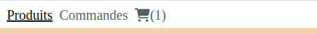

# About React context

**Problem you want to solve using Context**:

- You have several React components that are sharing the same state
- You want to notify several React components with the same user action (a button clicked, a value entered in an input...)
- You don't want to pass down too many `React.useState` props to several different React components

## Using the AppContext provided in this workshop

For Socarotte, we provided an implementation of the React context with a specific model to interact with it.

This section is about explaining how to use this `AppContext` in your application.

For this documentation, we will consider that you've added the `AppContext` code inside `frontend/src/AppContext.jsx` file.

### Dispatchers, State and reducers

Let's consider the following `AppContext`:

```jsx
import React from "react";

export const initialState = {
  basket: [],
};

export function reducer(state, action) {
  switch (action.type) {
    case "NEW_BASKET_ITEM":
      const { item } = action;
      return {
        ...state,
        basket: [...state.basket, item],
      };
    default:
      return state;
  }
};

export const AppContext = React.createContext();

function useAppContext() {
  return React.useContext(AppContext);
}

export default useAppContext;
```

The `initialState` object is the `state` of your application that can be **shared** with several React components.

The `reducer` function is the function that is called when one of the React component of your application calls `dispatch` function with a give `action` object with a specific `action.type` string.

The `reducer` function will return a new value of the `state` objects which will **trigger** a **re-rendering** of **every** React components the uses the `state`.

To use the `state` and the `dispatch` function in your React component you want to use context for, just use the following hook:

```jsx
const {state, dispatch} = useAppContext();
```

To `dispatch` an `action`, use the following code in your React Component:

```jsx
function AddItemToBasketButton() {
    const {state, dispatch} = useAppContext();
    return (
        <button onClick={function () {
            dispatch(
                {
                    type: "NEW_ITEM_ADDED",
                    item: { title: "carotte", price: 2.47 }
                }
            )
        }}></button>
    )
}
```

When user will click on the `AddItemToBasketButton`:

1. an `action` of `type` `NEW_ITEM_ADDED` will be `dispatched`
2. and the `reducer` function will be called with the `action` parameter which will be the object `{ type: "NEW_ITEM_ADDED", item: { title: "carotte", price: 2.47 } }`

    ```jsx
    function reducer(state, action) {
    switch (action.type) {
        case "NEW_BASKET_ITEM":
        const { item } = action;
        return {
            ...state,
            basket: [...state.basket, item],
        };
        default:
        return state;
    }
    };
    ```

> Note: the  `...` notation is called the [spread operator / syntax](https://developer.mozilla.org/en-US/docs/Web/JavaScript/Reference/Operators/Spread_syntax) and enables you to `spread` arrays and object inside another object. Here it's the same as adding `item` to the `state.basket` array of item

3. This call to `reducer` will then shift the `state` from ...

    ```js
    {
        basket: []
    }
    ```

    to

    ```js
    {
        basket: [
            { title: "carotte", price: 2.47 }
        ]
    }
    ```

4. **every** React components with the line `const { state, dispatch } = useAppContext()` or  `const { state } = useAppContext()` will be `re-rendered`

Let's consider our `ProductCard` React component from [React.useState hook documentation](./REACT-USE-STATE-HOOK.md).

### Example: Add to basket feature

**Feature**: When a user clicks on the `Add to basket` button:

- The `ProductCard` button is disabled
- a new `item` is added the the `basket` 
- the navigation menu `Badge` is incremented by 1
- the `BasketTable` React component displays the new `item` added

Considering the following `AppContext`:

```jsx
import React from "react";

export const initialState = {
  basket: [],
};

export function reducer(state, action) {
  switch (action.type) {
    case "NEW_BASKET_ITEM":
      const { item } = action;
      return {
        ...state,
        basket: [...state.basket, item],
      };
    default:
      return state;
  }
};

export const AppContext = React.createContext();

function useAppContext() {
  return React.useContext(AppContext);
}

export default useAppContext;
```

#### `AddToBasket` React component

The `AddToBasket` button React component will look like:

```jsx
import React from "react";
import {useAppContext} from "./AppContext.jsx"

function AddToBasket({item}) {
    const {state, dispatch} = useAppContext();

    // alreadyAdded is `true` if state.basket contains the `item` passed in props;
    // alreadtAdded is `false` otherwise
    const alreadyAdded = state.basket.includes((itemInBasket) => itemInBasket.title === item.title);

    return (
        <button disabled={alreadyAdded} onClick={
            function () {
                dispatch({type: "NEW_BASKET_ITEM", item: item })
            }
        }>{alreadyAdded ? "Déjà ajouté au panier" : "Ajouter au panier"}</button>
    )
}

export default AddToBasket;
```

This React component can be use inside the `ProductCard` component like:

```jsx
import React from "react"
import AddToBasket from "./AddToBasket.jsx"


function ProductCard({title, price, discount, imageSrc}) {
    return (
        <div className="card">
            ...
            <AddToBasket item={{title: title, price: price - discount}} />
        </div>
    )
}

export default ProductCard; 
```


#### `BasketTable` React component

The `BasketTable` React component looks like:

```jsx
import useAppContext from "./AppContext";
import "./Basket.css";

function EmptyBasket() {
  return <h4>Votre panier est vide</h4>;
}

function BasketTable() {
  const { state: { basket } } = useAppContext();

  return (
    <table>
        <thead>
            <tr>
                <th>Produit</th>
                <th>Prix</th>
            </tr>
        </thead>
        <tbody>
            {basket.length > 0 ? (
                basket.map((item, idx) => (
                    <tr key={idx}>
                        <td>{item.title}</td>
                        <td>{item.price} € / kg</td>
                    </tr>
                ))
            ) : (
            <tr>
                <td colSpan="2">
                    <EmptyBasket />
                </td>
            </tr>
            )}
        </tbody>
    </table>
  );
}

export default BasketTable;
```

The line `const { state: { basket } } = useAppContext();`  reads the `state.basket` proprety from the Application `state`.
When this value changes, the `BasketTable` React component gets `re-rendered`.

If some `item` are present in the `state.basket` array, then some table rows with `item.title` and `item.price` will be re-rendered.
If no items are in the `state.basket` array (e.g. initial state of the app), the the `EmptyBasket` React component will be rendered and the text `Votre panier est vide` will be displayed.


#### `MainMenu` with `Basket` navigation item React component

The MainMenu React component using `react-router-dom` and the `@fortawesome/react-fontawesome` library for the basket icon looks like:

```jsx
import { FontAwesomeIcon } from "@fortawesome/react-fontawesome";
import { faShoppingCart } from "@fortawesome/free-solid-svg-icons";
import NavItem from "./NavItem";
import useAppContext from "./AppContext";

function MainMenu() {
  const { state: { basket } } = useAppContext();
  const numberOfItemsInBasket = basket.length;

  return (
    <nav className="menu-horizontal">
      <ul>
        <li>
          <NavItem to="/product">Produits</NavItem>
        </li>
        <li>
          <NavItem to="/command">Commandes</NavItem>
        </li>
        <li>
          <NavItem to="/basket">
            <FontAwesomeIcon icon={faShoppingCart} />
            {numberOfItemsInBasket > 0 && `(${numberOfItemsInBasket})`}
          </NavItem>
        </li>
      </ul>
    </nav>
  );
}

export default MainMenu;
```

The line `const { state: { basket } } = useAppContext();` reads the `state.basket` array of `item` which will re-render the `MainMenu` when `state.basket` will change.

The next line `const numberOfItemsInBasket = basket.length;` is only keeping the number of `item` in `state.basket` by reading the lenght of the `state.basket` array.

This will then render the `(1)` when one item is added to the `state.basket` array, `(2)` when a second item will be added, etc.



#### Summary

When a user clicks on a `Ajouter au panier` button, exposed by the `AddToBasket` React component, an `action` with `{ type: "NEW_BASKET_ITEM", item: {title: "...", price: ... }}` is `dispatched` using the `dispatch` function obtain by the `useAppContext()` hook.

Then, the `reducer` function from the `AppContext.jsx` file is called and will transform the initial state of `{ state: { basket: [] } }` to `{ state: { basket: [ { title: "...", price: ... } ] } }`.

A new `state` is set which will:

- re-render the `MainMenu`; which will render a `(1)` next to the basket icon
- re-render the `AddToBasket` button of the clicked item; which will render the button as `disabled` and replace the text to `Déjà ajouté au panier`
- re-render the `BasketTable`; which will render the table with one row corresponding to the `item` dispatched

That's all there is to know, with this setup, you should be able to implement **any** reactivity what so ever to your application.
