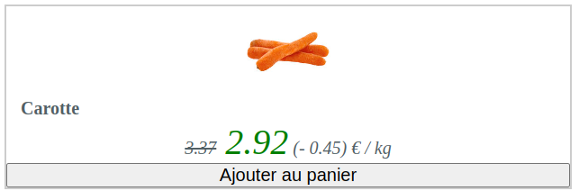

# `React.useState` hook

This page is about the basic `React.useState` hook that can be use to to handle simple reactivity at a React component level.

## Example: button `onClick`

Here is what we want to achieve:


When a user clicks on the `Ajouter au panier` button, we want it to be disabled and
replace the text by `Déjà ajouté au panier`.

Here is how the `Carotte`'s `ProductCard` React component is written:

```jsx
import React from "react"

function ProductCard({title, price, discount, imageSrc}) {
    return (
        <div className="card">
            <div className="card-header">
                
            </div>

            <div className="card-content">
                <h4>{title}</h4>
            </div>
            <div className="card-footer">
                <span>
                <i>
                    <s>{price}</s>
                    <span className="discount"> {price - discount}</span> (- {discount})
                    € / kg
                </i>
                </span>
            </div>
            <div className="card-actions">
                <button>
                    <i className="fa fa-shopping-cart"></i>
                    Ajouter au panier
                </button>
            </div>
        </div>
    )
}

export default ProductCard;
```

This React component is not interactive yet. When called with `<ProdcutCard title="Carotte" price="3.37" discount="0.45" imageSrc="path/to/carrotte.png" />` , it renders the following:
.

Now, you can add an `onClick` `props` to the default `button` JSX element to trigger some function when the button is being clicked by a user.

For instance,

```jsx
import React from "react"

function ProductCard({title, price, discount, imageSrc}) {
    return (
        <div className="card">
            ...
            <div className="card-actions">
                <button onClick={function() {
                    console.log("I got clicked!");
                }}>
                    <i className="fa fa-shopping-cart"></i>
                    Ajouter au panier
                </button>
            </div>
        </div>
    )
}

export default ProductCard;
```

If we zoom on the code we've just added:

```jsx
onClick={function() {
    console.log("I got clicked!");
}}
```

When a user will click on the button, a new message with `I got clicked!` will be displayed in the browser console.

React offers a hook called [React.useState](https://react.dev/reference/react/useState).
Hooks are function that you can only call at the root of a React component.

This `React.useState` hooks gives us back an array of 2 values:

- a `value`
- a `function` that returns a new `value`.

**And whenever the `value` of the `React.useState` hook changes, the component gets re-rendered**.

Here is how you can use it:

```jsx
import React from "react";
function ProductCard({title, price, discount, imageSrc}) {

    // Creates a new local state using the hook `React.useState`;
    //  initialized to false the first rendering
    //  when a user clicks button:
    const [alreadyAdded, setAlreadyAdded] = React.useState(false);

    return (
        <div className="card">
            ...
            <div className="card-actions">
                <button
                    disabled={alreadyAdded}
                    onClick={function() {
                        setAlreadyAdded(true);
                    }}>
                    <i className="fa fa-shopping-cart"></i>{" "}
                    {alreadyAdded ? "Déjà ajouté au panier" : "Ajouter au panier"}
                </button>
            </div>
        </div>
  );
}

export default ProductCard;
```

This line...

```jsx
const [alreadyAdded, setAlreadyAdded] = React.useState(false);
```

...calls the function `React.useState` with the initial value of `false`.
It means that `alreadyAdded` is equal to `false` when the component will render for the first time.

Then:

1. On the first rendering of this React component:
   1. `alreadyAdded` is set to `false`
   2. the button with then **not** be disabled by the button `props` `disabled` since `disabled={aldreadAdded}` will be like saying `disabled={false}`
   3. and the text inside the button returned by the [ternary](https://developer.mozilla.org/en-US/docs/Web/JavaScript/Reference/Operators/Conditional_operator) `alreadyAdded ? "Déjà ajouté au panier" : "Ajouter au panier"` will return `Ajouter au panier` since `alreadyAdded` is `false`.

2. When a user clicks on the `button`; the function...

    ```jsx
    function() {
        setAlreadyAdded(true);
    }
    ```

    ...is called and will set the `alreadyAdded` value to `true`.
3. Because the `alreadyAdded` value changed from ~~`false`~~ to `true`, the `ProductCard` component will be re-rendered but this time the `alreadyAdded` value will be set to `true`.
4. the button with then become `disabled` with this props `disabled={alreadyAdded}` since it will be like `disabled={true}`.
5. and the [ternary](https://developer.mozilla.org/en-US/docs/Web/JavaScript/Reference/Operators/Conditional_operator) `alreadyAdded ? "Déjà ajouté au panier" : "Ajouter au panier"` will return `Déjà ajouté au panier` since `alreadyAdded` is `true`

## Read the doc

Feel free to read more on this hook [on the official documentation of React](https://react.dev/reference/react/useState)
